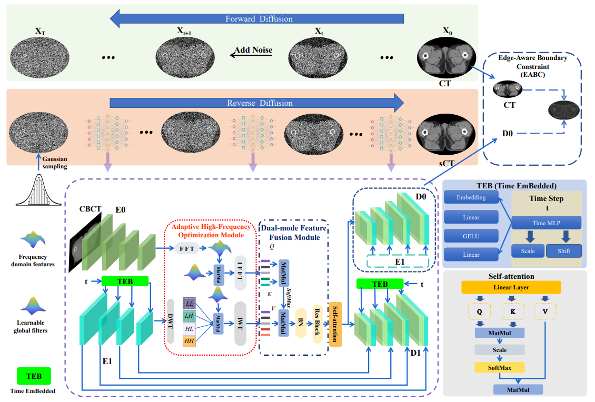

# Texture-Preserving Diffusion Model for CBCT-to-CT Synthesis



# Dataset
## You should structure your aligned dataset in the following way:
```
data_path/
  2PA092
    ├── CT
    │   ├── 0.npy
    │   ├── 1.npy
    │   ├── ...
    ├── CBCT
    │   ├── 0.npy
    │   ├── 1.npy
    │   ├── ...
  2PA093
    ├── CT
    │   ├── 0.npy
    │   ├── 1.npy
    │   ├── ...
    ├── CBCT
    │   ├── 0.npy
    │   ├── 1.npy
    │   ├── ...
  ...

```

The dataset links used in this study are as follows:
1. [SynthRAD2023](https://synthrad2023.grand-challenge.org/)
2. [Pelvic-ReferenceData](https://wiki.cancerimagingarchive.net/display/Public/Pelvic-ReferenceData)


Before using the dataset, convert the `nii.gz` data to `npy` format using `reg/nii2npy.py`, and perform registration using `syn`. 
All the data is standardized using the mean and standard deviation of the raw data. The data processing is handled in dataloader.py  


# Dependencies
```
albumentations==1.3.0
einops==0.6.1
matplotlib==3.5.2
numpy==1.21.5
opencv_contrib_python==4.7.0.72
Pillow==9.5.0
scikit_image==0.19.2
scikit_learn==1.2.2
SimpleITK==2.2.1
timm==0.6.12
torch==2.0.0
tqdm==4.64.1
```
# Installation
* ### Clone this repo:
```
git clone https://github.com/zyj15416/TPDM-CBCT2CT.git
cd TPDM-CBCT2CT
```

# Train
```
python train.py, the hyperparameter settings are handled in `utils/utils.py`.
```
# Predict
```
You can use `predict.py` to load the weights and test the dataset, and you can modify the number of samples to improve the inference time.
```

# Pretrained Models
```
We have released pretrained weights for cbct->ct in SynthRAD2023 challenge dataset(https://pan.baidu.com/s/1ATAeiGnNeaF1G0E1z974KQ?pwd=k7m4 ). You can save these weights in relevant checkpoints folder and perform inference.
```
* ### sample_test01
```
 A limited set of preprocessed CBCT and CT samples is provided in `sample_test01` to facilitate validation of the model's performance.
```
# Citation
```
If you find this repository useful for your research, please use the following.
{

}
```
